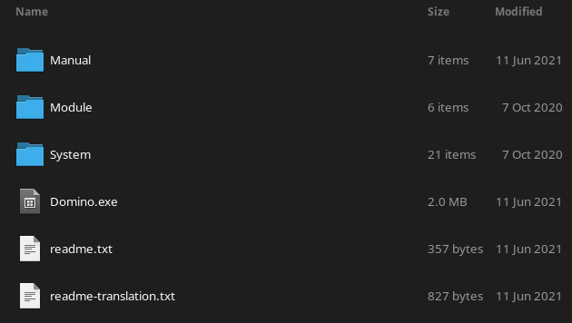

# Getting Started

This guide will help you get started on downloading and setting up Domino for the best working environment

## Installation

!!! info "Different Domino Versions"

    As discussed in the home page, there are 3 versions of Domino which you can choose. Click on a link to be directed to visit their download pages:

    -   [The normal 32-bit version](https://takabosoft.com/domino)
    -   [The community-translated version](https://github.com/Hans5958/Domino-English-Translation/releases/latest)
    -   [The 64-bit dev version]()

    You are free to choose any version you'd wish to use, but I will be using the english translated version.

First, download the version of Domino you wish to use.

??? note "For the english translated version, you will want the **zip version**."

    

Unzip the file you downloaded anywhere you'd like and you should see the following files:

Congratulations, you have successfully installed Domino. Feel free to create a shortcut or something to your Desktop or pin to your taskbar.

## Configuring Audio

When you first boot up Domino, you may notice that you do not have any audio playing. That is because by default Domino has no MIDI outs setup. This is how you setup Domino to play audio.

??? warning "Synth Required"

    For this to work, you will need a synth setup and running on your system. Windows provides a default synthesizer for you, but it is terrible in performance.
    I recommend you to use [OmniMIDI](/OmniMIDI) for your synthesizer as this synth was made for Black MIDIs and provides the best performance.
