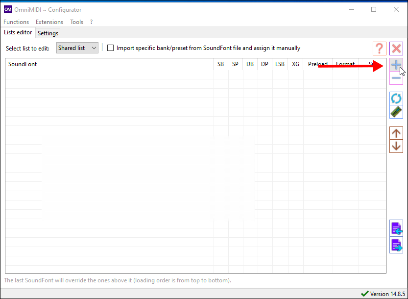
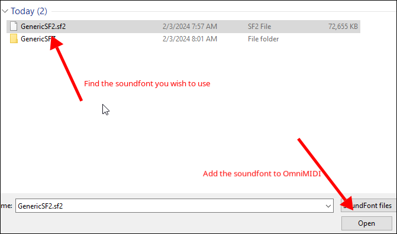
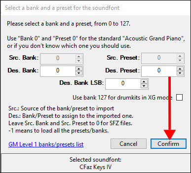

# Adding Soundfonts

Adding soundfonts is pretty simple in OmniMIDI. Typically, soundfonts come in 2 different formats: `sfz` and `sf2`. `sfz` format soundfonts come with a "samples" folder and must be included with the `sfz`. `sf2` is one file only and does not need this extra folder. Both accomplish the same thing but in different ways.

!!! info "Help! I have no soundfonts!"

    If you have no soundfonts available, you are free to Google soundfonts and use those. Although not recommended as some soundfonts do not pair well with Black MIDIs. Instead, you can use our [list of recommended soundfonts](#recommended-soundfonts) to find yourself a good soundfont to use! Other resources will include Black MIDI Community Discord servers.

## Add a Soundfont

After installing OmniMIDI and opening the configurator, click the + in the configurator window.

Next, select the soundfont you want and press open.

### SFZ Dialog

If you are adding an SFZ, you will encounter this dialog. Just click confirm to add your soundfont

## Soundfont Added

You have added your soundfont to your synth! Congratulations! You are now free to start using OmniMIDI as-is and hear audio when playing MIDIs!

