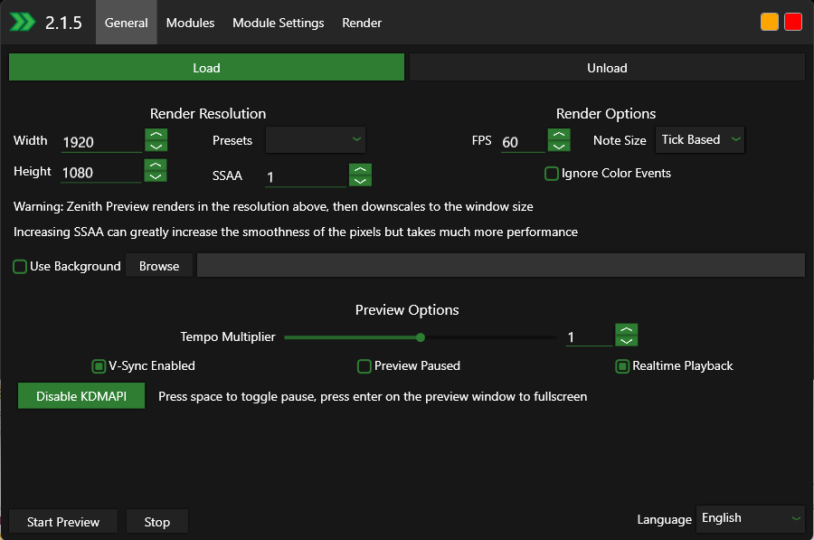

# Renderring Black MIDI

There are two recommended options that you can choose to render your own Black MIDI videos. Such as Zenith and Ultralight MIDI Player

## Zenith

??? info "What is Zenith?"

    Zenith is an open-source Black MIDI renderer made by Arduano. It is a great option for the starter to render Black MIDI easily.

Zenith also includes note count rendering, which can be customized easily and has more infos

Zenith has 2 versions which you can choose to start with:

-   [The original Zenith](https://github.com/arduano/Zenith-MIDI), made by Arduano
-   [Modded version](https://github.com/null7323/Zenith-MIDI-Modded), made by null7323

Pros:

- Good for starters.
- Can be customized by using plugins.
- Extremely RAM optimized.

Cons:

? ToDo: Add Cons

- Very slow when rendering (unless using the modded version)

## Ultralight MIDI Player

??? info "What is Ultralight MIDI Player?"

    Ultralight MIDI Player (abbreviated as UMP) is a Java-based Black MIDI renderer developed by PipiraMine. Not only for rendering, it is also possible to play Black MIDI there. It is known to the community because of how fast it goes when rendering and customizing the skins.

UMP has both release and beta versions. The release version has no bugs meanwhile beta version has early features included. 

Pros:

- Great performance when rendering or playing Black MIDI.
- Possible to customize the skins using a resource pack.
- Faster MIDI load and less memory usage.

Cons:

- Only for experts and not recommended to starters.
- No warranty, and CPU speed also impacts UMP performance.
- WinMM patch is required (for Windows 10 and later)

## Common Links

> ToDo: Making another page.
Here are some of the common things people ask for when rendering a Black MIDI.

-   Rendering using Zenith
-   Rendering using UMP
-   Rendering note count
